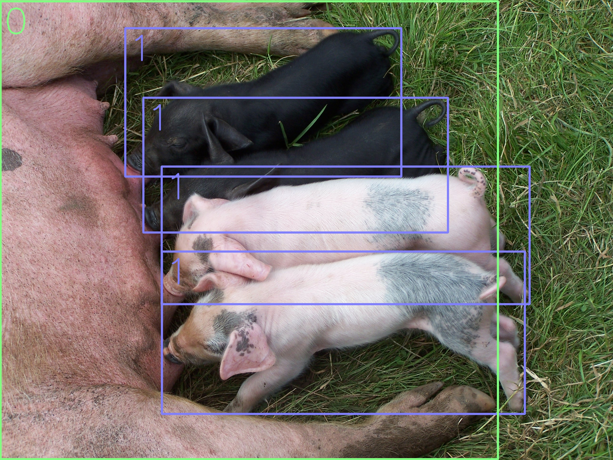

# Pig & Piglet Detection
In this use case, your task is to detect pigs and piglets and separate them from each other. 

You will be receiving images of animals, where you need to predict the bounding box locations of the pigs and piglets. The predictions should contain the top left and bottom right normalized coordinates of the predicted bounding box, as well as an object class and a confidence score. **Pigs have object class 0 and piglets have object class 1.** The confidence score is a value in the range [0-1] referring to the certainty of the detection. See the image below for an illustation of the concept. The validation set contains 59 samples and the test set contains 180 samples.

<p align="center">
  
</p>

All the images have been rescaled to have a fixed width of 640 px. A single image can contain up to 15 objects. **You have 10 seconds to return your predictions for each image.**
Samples with piglets will only contain what we deem a *visually clear piglet*. Thus, if it has been difficult to assess wheter an image contains a pig or a piglet, the image is removed. Such an example is given below.
<p align="center">
  
</p>

## Evaluation
During the week of the competition, you will be able to validate your solution against a validation set. The best score your model achieves on the validation set will be displayed on the scoreboard.

Your model will be evaluated using the COCO mean Average Precission (COCO <a href="https://jonathan-hui.medium.com/map-mean-average-precision-for-object-detection-45c121a31173">mAP</a>). The score ranges from [0-1], with 1 being the highest score.
The validation request timeouts after 10 seconds, so you need to make sure that your solution can handle an images in under 10 seconds.

Notice that you can only submit once! We encourage you to validate your code and API before you submit your final model. You can find the documentation of your API where you can try out your model and verify the prediction. <br>
The documentation is by default found at `0.0.0.0:4242/docs`, and then find the prediction endpoint for the use case.

After evaluation, your final score will be provided. This score can be seen on the <a href="https://cases.dmiai.dk/">scoreboard</a> shortly after.

### Evaluation Metric
We use the <a href="https://pypi.org/project/mean-average-precision/">mean-average-precission</a> package to evaluate you model. Specifically, we use:
```python
from mean_average_precision import MetricBuilder
metric_fn = MetricBuilder.build_evaluation_metric("map_2d", async_mode=True, num_classes=2)
# add predictions
print(f"COCO mAP: {metric_fn.value(iou_thresholds=np.arange(0.5, 1.0, 0.05), recall_thresholds=np.arange(0., 1.01, 0.01), mpolicy='soft')['mAP']}")
```

## Getting started using Emily
Once the repository is cloned, navigate to the folder using a terminal and type:
```
emily open pig-piglet-detection
```
You will be prompted for selecting an application. Please note, that you need to select a Computer Vision image, if you want to use opencv. Afterwards you can select your prefered deep learning framework. Then select an editor of your choice to open the Emily template for the use case. A Docker container with a Python environment will be opened. Some content needs to be downloaded the first time a project is opened, this might take a bit of time. You can mount a folder with data to your project using the ```emily mount``` command.

A dummy prediction endpoint has been created in ```router.py```. The prediction uses the DTOs from ```models/dtos.py```, to ensure that the request and response have the correct format. To take full advantage of Emily and the template, your code for prediction should go in here:
```python
@router.post('/predict', response_model=PredictResponseDto)
def predict_endpoint(request: PredictRequestDto):
    img: np.ndarray = decode_request(request)

    dummy_bounding_boxes = predict(img)
    response = PredictResponseDto(
        boxes=dummy_bounding_boxes
    )

    return response
```
You can add new packages to the Python environment by adding the names of the packages to requirements.txt and restarting the project, or by using pip install on a terminal within the container which will result in the package being installed temporarily i.e. it is not installed if the project is restarted. <a href="https://emily.ambolt.io/docs/latest">Click here</a> to visit the Emily documentation.

## Submission
When you are ready for submission, <a href="https://emily.ambolt.io/docs/v3.0.5/guides/deploy-your-api">click here</a> for instructions on how to deploy with Emily. Then, head over to the <a href="https://cases.dmiai.dk/pig-vs-piglet-detection">Submission Form</a> and submit your model by providing the host address for your API and your UUID obtained during sign up. Make sure that you have tested your connection to the API before you submit!<br>
