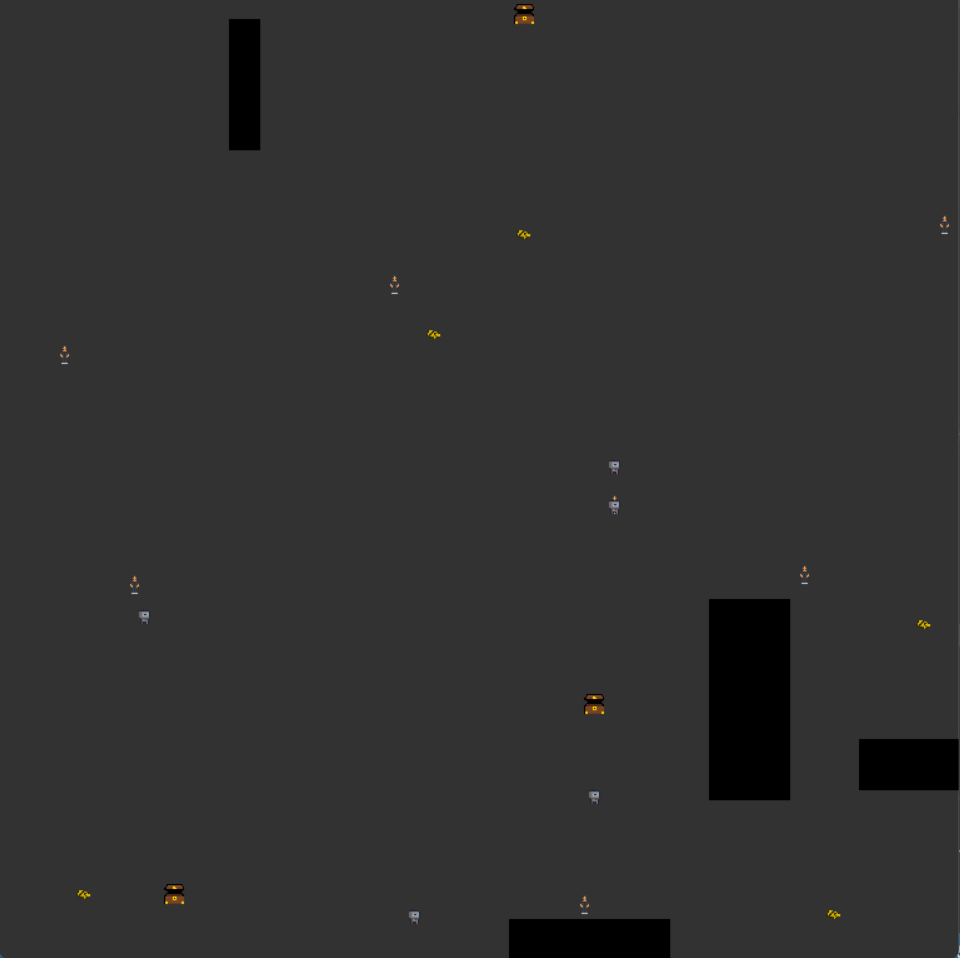

# Robot Robbers
In this use case, you should develop a system for playing robot robbers.
The Robot Robbers game is an interactive 2D game where you, the player, control 5 robots trying to steal money from angry scrooges.

<p align="center">
  
</p>

<i>A description of the invididual icons will follow.</i>

The objective of this use case is to reach the highest possible reward in 2 wall-clock minutes. Balance the trade off between time and performance well!

## Evaluation
During the week of the competition, you will be able to validate your solution against a validation set. The best score your model achieves on the validation set will be displayed on the scoreboard.

Your model will be evaluated on how close to the actual ratings your predictions are. To be exact, your score is measured as the distance between your prediction and the actual rating. An average error for all reviews is calculated and used as your score. i.e. the evaluation metric is mean absolute error.
The score will be normalized in the interval 0.0 to 1.0 and flipped such that a low error grants the most points.
The validation request timeouts after 30 seconds, so you need to make sure that your solution can handle 1000 reviews in under 30 seconds.

Notice that you can only submit once! We encourage you to validate your code and API before you submit your final model. You can find the documentation of your API where you can try out your model and verify the prediction. <br>
The documentation is by default found at `0.0.0.0:4242/docs`, and then find the prediction endpoint for the use case.


After evaluation, your final score will be provided. This score can be seen on the <a href="https://cases.dmiai.dk/">scoreboard</a> shortly after.

## Getting started using Emily
Once the repository is cloned, navigate to the folder using a terminal and type:
```
emily open sentiment-analysis
```
You will be prompted for selecting an application. For this use case, it might be beneficial to use a Natural Language Processing image, where you can select your prefered deep learning framework. Afterwards, you will be asked to mount a data folder for your project. This folder should include your data, for the first run it can empty and you can add data later. Then select an editor of your choice to open the Emily template for the use case. A Docker container with a Python environment will be opened. Some content needs to be downloaded the first time a project is opened, this might take a bit of time.

To take full advantage of Emily and the template, your code for prediction should go in api.py:
```python
@app.post('/api/predict', response_model=SentimentAnalysisResponseDto)
def predict(request: SentimentAnalysisRequestDto) -> SentimentAnalysisResponseDto:

    ratings = [random.randint(1, 5) for review in request.reviews]

    return SentimentAnalysisResponseDto(scores=ratings)
```
For further details about the recommended structure, see <a href="https://amboltio.github.io/emily-intro/emily-intro/">this guide</a>.
You can add new packages to the Python environment by adding the names of the packages to requirements.txt and restarting the project, or by using pip install on a terminal within the container which will result in the package being installed temporarily i.e. it is not installed if the project is restarted. <br>

## Testing the connection to the API
See <a href="https://amboltio.github.io/emily-intro/deploy/test/">this guide</a> for details on how to test your setup before final submission.

## Submission
When you are ready for submission, <a href="https://amboltio.github.io/emily-intro/deploy/">click here</a> for instructions on how to deploy. Then, head over to the <a href="https://cases.dmiai.dk/">Submission Form</a> and submit your model by providing the host address for your API and your UUID obtained during sign up. Make sure that you have tested your connection to the API before you submit!<br>
